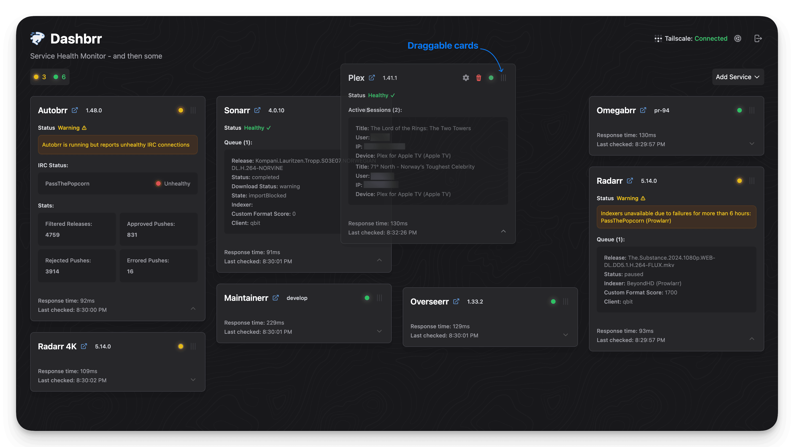
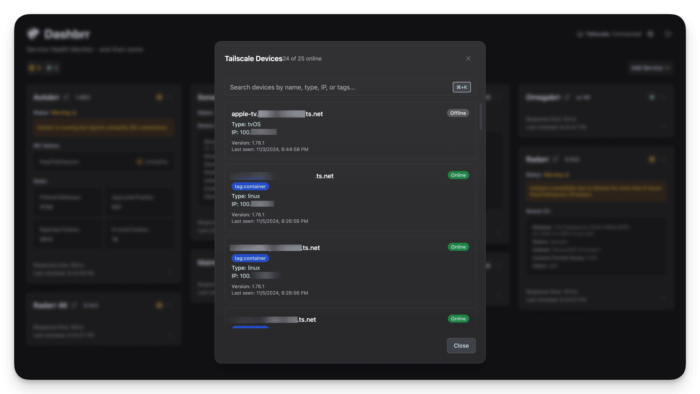
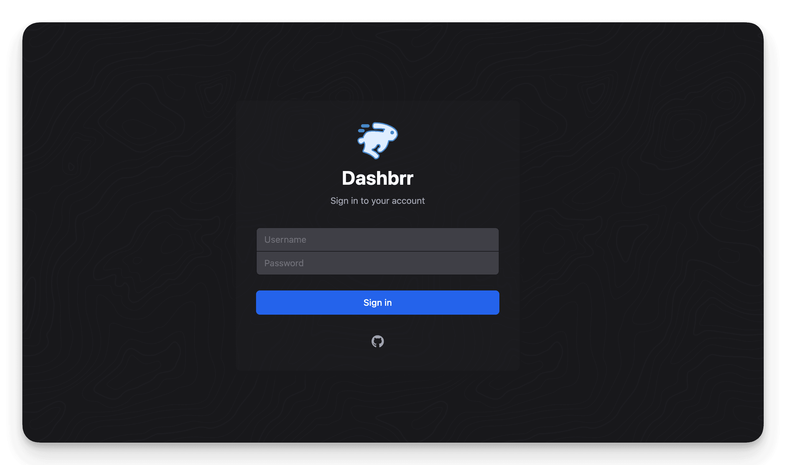
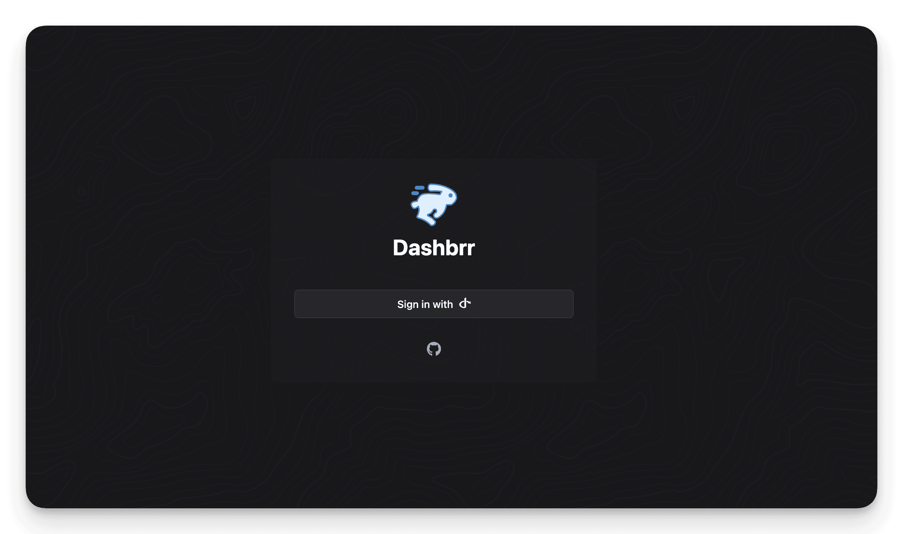

# Dashbrr

A sleek, modern dashboard for monitoring and managing your media stack services.


## Table of Contents

- [Features](#features)
- [Supported Services](#supported-services)
- [Tech Stack](#tech-stack)
- [Installation](#installation)
  - [Docker Installation](#docker-installation)
  - [Manual Installation](#manual-installation)
- [Configuration](#configuration)
  - [Configuration File](#configuration-file)
  - [Environment Variables](#environment-variables)
  - [Authentication](#built-in-authentication)
- [Screenshots](#screenshots)

## Features

- Real-time service health monitoring
- Service-specific data display and management
- Cached data with live updates
- SSE (Server-Sent Events)
- Built-in authentication system
  - With optional **OpenID Connect (OIDC)** support
- Responsive and modern UI
- Docker support
- Multiple database support (SQLite & PostgreSQL)

## Supported Services

### Plex

- Active streams monitoring
- Version check

### Sonarr & Radarr

- Queue monitoring
- Stuck downloads detection
- Indexer and download client error reporting
- Version check

### Autobrr

- IRC network health monitoring
- Release statistics tracking
- Version check

### Overseerr

- Pending requests monitoring
- Request management (approve/reject)
- Recent requests history
- Version check

### Prowlarr

- Indexer health monitoring

### Maintainerr

- Rule matching statistics
- Scheduled deletion monitoring
- Version check

### Omegabrr

- Service health monitoring
- Trigger manual runs of ARRs and Lists
- Version check

### Tailscale

- Device status monitoring (online/offline)
- Device information tracking (IP, version, type)
- Update availability notifications
- Tag management and filtering
- Quick access to device details
- Device search functionality

## Tech Stack

- **Backend**
  - Go
  - Gin web framework
  - Flexible caching system:
    - In-memory cache
    - Redis (optional)
  - Database support:
    - SQLite
    - PostgreSQL
- **Frontend**
  - React
  - TypeScript
  - Vite
  - TailwindCSS
  - PNPM package manager

## Installation

### Docker Installation

We provide a distroless container image for enhanced security and smaller size. You can either use our pre-built image or build it yourself.

#### Using Pre-built Image

We provide two Docker Compose configurations:

- `docker-compose.yml` - Uses in-memory cache
- `docker-compose.redis.yml` - Uses Redis cache

For in-memory cache (default):

```bash
docker compose up -d
```

For Redis cache:

```bash
docker compose -f docker-compose.redis.yml up -d
```

Both configurations support SQLite and PostgreSQL as database options. Here's the SQLite configuration:

```yaml
services:
  app:
    container_name: dashbrr
    image: ghcr.io/autobrr/dashbrr:latest
    ports:
      - "8080:8080"
    environment:
      - CACHE_TYPE=memory # or use docker-compose.redis.yml for Redis
      - DASHBRR__DB_TYPE=sqlite
      - DASHBRR__DB_PATH=/data/dashbrr.db
      - DASHBRR__LISTEN_ADDR=0.0.0.0:8080
      #- OIDC_ISSUER=optional
      #- OIDC_CLIENT_ID=optional
      #- OIDC_CLIENT_SECRET=optional
      #- OIDC_REDIRECT_URL=optional
    volumes:
      - ./data:/data
      # Mount a custom config file (optional)
      #- ./config.toml:/config.toml
    command:
      # Specify custom config file path (optional)
      #- "-config=/config.toml"
    restart: unless-stopped
    networks:
      - dashbrr-network

networks:
  dashbrr-network:
    name: dashbrr-network
    driver: bridge
```

And here's the PostgreSQL configuration:

```yaml
services:
  app:
    container_name: dashbrr
    image: ghcr.io/autobrr/dashbrr:latest
    ports:
      - "8080:8080"
    environment:
      - CACHE_TYPE=memory # or use docker-compose.redis.yml for Redis
      - DASHBRR__DB_TYPE=postgres
      - DASHBRR__DB_HOST=postgres
      - DASHBRR__DB_PORT=5432
      - DASHBRR__DB_USER=dashbrr
      - DASHBRR__DB_PASSWORD=dashbrr
      - DASHBRR__DB_NAME=dashbrr
      - DASHBRR__LISTEN_ADDR=0.0.0.0:8080
      #- OIDC_ISSUER=optional
      #- OIDC_CLIENT_ID=optional
      #- OIDC_CLIENT_SECRET=optional
      #- OIDC_REDIRECT_URL=optional
    volumes:
      - ./data:/data
      # Mount a custom config file (optional)
      #- ./config.toml:/config.toml
    command:
      # Specify custom config file path (optional)
      #- "-config=/config.toml"
    depends_on:
      postgres:
        condition: service_healthy
    restart: unless-stopped
    networks:
      - dashbrr-network

  postgres:
    container_name: dashbrr-postgres
    image: postgres:15-alpine
    environment:
      - POSTGRES_USER=dashbrr
      - POSTGRES_PASSWORD=dashbrr
      - POSTGRES_DB=dashbrr
    volumes:
      - postgres_data:/var/lib/postgresql/data
    networks:
      - dashbrr-network
    healthcheck:
      test: ["CMD-SHELL", "pg_isready -U dashbrr"]
      interval: 10s
      timeout: 5s
      retries: 3
    restart: unless-stopped

volumes:
  postgres_data:
    name: dashbrr_postgres_data

networks:
  dashbrr-network:
    name: dashbrr-network
    driver: bridge
```

Start the containers:

```bash
docker compose up -d
```

#### Building Your Own Image

Clone the repository and use either:

```bash
# Using Docker directly
docker build -t dashbrr .

# OR using Make (builds and runs everything)
make help # to see options
```

### Manual Installation

1. Install dependencies:

   - Go 1.23 or later
   - Node.js LTS
   - PNPM
   - Redis (optional)
   - PostgreSQL (optional)

2. Build and run:

```bash
git clone https://github.com/autobrr/dashbrr.git
cd dashbrr

# Development mode with SQLite (runs frontend and backend)
make dev

# OR Development mode with PostgreSQL
make docker-dev

# OR Production build
make run

# Run with custom config file
./dashbrr -config=/path/to/config.toml
```

For more build options:

```bash
make help
```

## Configuration

### Configuration File

Dashbrr supports configuration through a TOML file. By default, it looks for `config.toml` in the current directory, but you can specify a custom path:

- When running the binary directly: `./dashbrr -config=/path/to/config.toml`
- In Docker Compose:
  ```yaml
  services:
    app:
      volumes:
        - ./custom-config.toml:/config.toml
      command:
        - "-config=/config.toml"
  ```

The configuration file settings can be overridden by environment variables. See the [Environment Variables](#environment-variables) section for details.

Example config.toml:

```toml
# This is the default configuration created when no config file exists
[server]
listen_addr = ":8080"

[database]
type = "sqlite"
path = "./data/dashbrr.db"
```

### Environment Variables

#### Required

- `DASHBRR__LISTEN_ADDR`: Listen address for the server (default: 0.0.0.0:8080)
  - Format: `<host>:<port>` (e.g., 0.0.0.0:8080)

#### Cache Configuration

Dashbrr supports two caching backends:

- `CACHE_TYPE`: Cache implementation to use (default: "redis" if REDIS_HOST is set, "memory" otherwise)
  - `redis`: Uses Redis for caching
  - `memory`: Uses in-memory cache

Redis-specific settings (only required when CACHE_TYPE=redis):

- `REDIS_HOST`: Redis host address (default: localhost)
- `REDIS_PORT`: Redis port number (default: 6379)

The memory cache requires no additional configuration and is automatically used when:

- CACHE_TYPE is set to "memory"
- Redis connection fails in development mode
- REDIS_HOST is not set

#### Database Configuration

SQLite (default):

- `DASHBRR__DB_TYPE`: Set to "sqlite"
- `DASHBRR__DB_PATH`: Path to SQLite database file

PostgreSQL:

- `DASHBRR__DB_TYPE`: Set to "postgres"
- `DASHBRR__DB_HOST`: PostgreSQL host address
- `DASHBRR__DB_PORT`: PostgreSQL port (default: 5432)
- `DASHBRR__DB_USER`: PostgreSQL username
- `DASHBRR__DB_PASSWORD`: PostgreSQL password
- `DASHBRR__DB_NAME`: PostgreSQL database name

#### Built-in Authentication

- Default authentication system
- User management through the application
- No additional configuration required

#### OpenID Connect (OIDC)

To enable OIDC authentication, set the following environment variables:

- `OIDC_ISSUER`: Your OIDC provider's issuer URL
- `OIDC_CLIENT_ID`: Client ID from your OIDC provider
- `OIDC_CLIENT_SECRET`: Client secret from your OIDC provider
- `OIDC_REDIRECT_URL`: Callback URL for OIDC authentication (default: <http://localhost:3000/auth/callback>)

It has been tested and working with [Auth0](https://auth0.com/)

## Screenshots


_Main dashboard showing service health monitoring and status cards_


_Cards can be dragged and sorted to your liking. You can also collapse them if you wish._


_Tailscale device management and monitoring_


_Built-in authentication system_


_Optional OpenID Connect (OIDC) authentication support_
